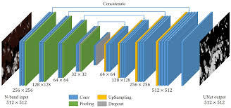
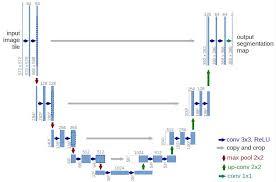

# Pytorch implementation of U-Net architecture
In this project, the U-Net architecture is implemented according to the scientific article [Very Deep Convolutional Networks for Large-Scale Image Recognition](https://arxiv.org/abs/1505.04597)



## Run
```python unet.py```

